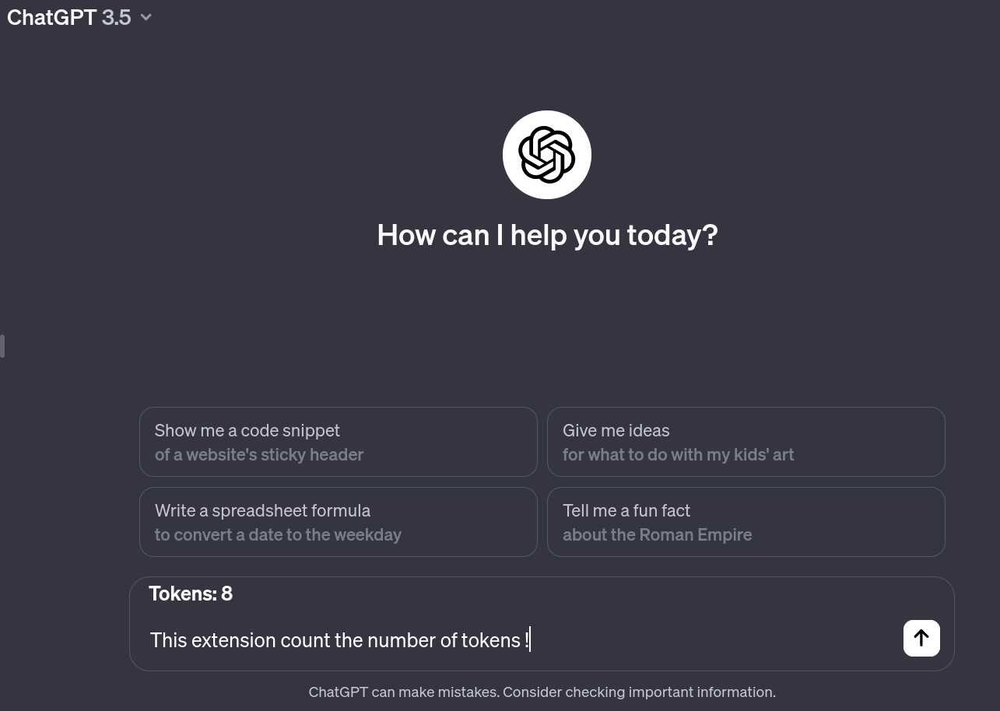

# Token Counter for ChatGPT

This Chrome extension shows the number of tokens in the current prompt for ChatGPT.

**Download here:** [Chrome Web Store]([https://chrome.google.com/webstore/detail/token-counter-for-chatgpt/](https://chromewebstore.google.com/detail/token-counter-for-chatgpt/njepjfebkcdhfobjfgpgblgoeighgfie?hl=fr))

## About Token Counter for ChatGPT

Token Counter for ChatGPT is a useful browser extension designed to enhance your ChatGPT experience on Chrome. Are you curious about the number of tokens in your current prompt? With this extension, you can easily keep track of the token count as you compose your prompts.

Whether you're a writer, student, or language enthusiast, knowing the token count can help you manage your text effectively within the limitations of the ChatGPT model. This extension seamlessly integrates with the ChatGPT interface, displaying the token count right alongside your prompt.

## Features

- Real-time token counting as you type
- Seamless integration with the ChatGPT interface
- Helps manage the length of your input within ChatGPT's token limits
- No more manual counting—enjoy a more efficient writing process

## Installation

Visit the [Chrome Web Store]([https://chrome.google.com/webstore/detail/token-counter-for-chatgpt/](https://chromewebstore.google.com/detail/token-counter-for-chatgpt/njepjfebkcdhfobjfgpgblgoeighgfie?hl=fr)) and add the extension to your browser with a single click.

## Usage

Once installed, the token count will automatically display as you interact with ChatGPT on chat.openai.com. It's that simple!

## Support

Star this project on GitHub for updates and new features, and feel free to report any issues or suggest improvements.

**Star the project here:** [GitHub Repository](https://github.com/VendenIX/tokenCounterChatGPT)

Your feedback is invaluable in making this tool better for everyone!

---

Enhance your ChatGPT interactions with the Token Counter for ChatGPT extension today!
